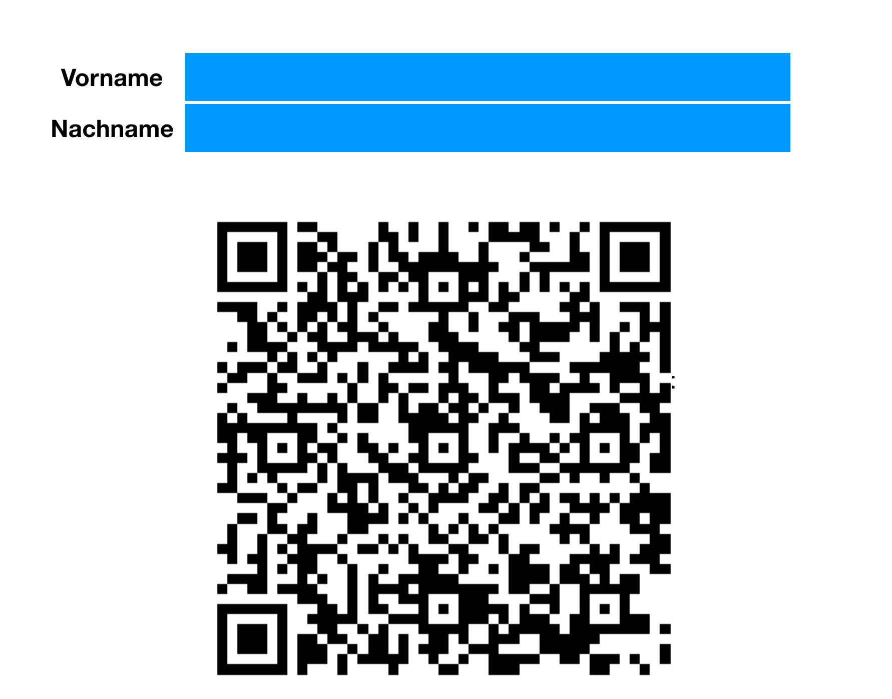

# WirVsVirusHack Grenzkontrolle
Bei Hackathon WirVsVirus entstandenes Repo bzgl. Speicherung und Bearbeitung von Formularen zur Einreise

PoC ist [HIER](https://hack.niklas.codes/qrcode_generator.html) erreichbar.

Devcode Link: [HIER](https://devpost.com/software/1_036_grenzkontrolle_abfertigung_grenzkontrolle)
Decvode einladungs link: [HIER](https://devpost.com/software/1_036_grenzkontrolle_abfertigung_grenzkontrolle/joins/FwtIZ3XI45SHel2EHo7ZoA)

wir organisieren uns in [diesem Google Sheet](https://docs.google.com/spreadsheets/d/1DYOr3Wl2GHaUMSgQ8veHVlyrMpHCK39O5asMlbUhi6U/edit#gid=0). tragt euch dort bitte ein.
Wenn kein Zugriff auf das Repo, bitte PR's ich gebe euch so früh wie es geht schreibrechte auf das Repo.

Todo's werden als Issues angelegt.

Wir haben uns darauf geeinigt, erstmal einen möglichst kleinen PoC zu erstellen um alles ans rollen zu bekommen.

PoC soll so ausschauen:

# Weitere Informationen
[Ab 1:44](https://www.youtube.com/watch?v=JG4D3ZPHFU0?t=104) sieht man eine Grenz"kontrolle"
